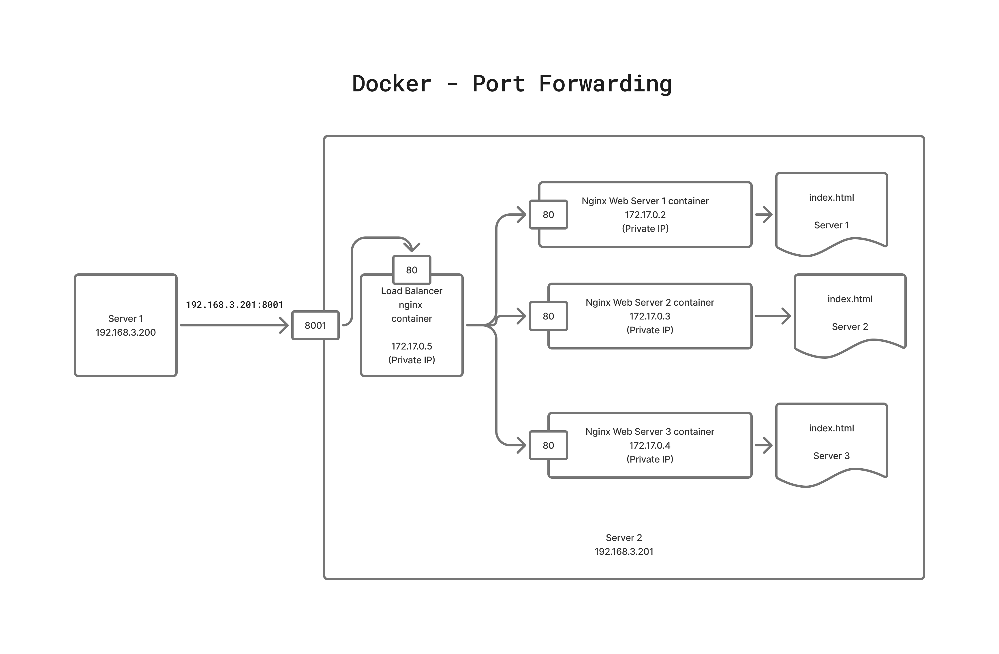

# Day 1

## Lab - Cloning this repository in your training machine ( terminal )
```
cd ~
git clone https://github.com/tektutor/openshift-1317oct-2025.git
```

## Info - Hypervisor Overview
<pre>
- Hypervisor is generic term for virtualization technology
- with the help of virtualization, we can run multiple OS on a single physical machine
- multiple OS can actively run side by side
- there are 2 types of Hypervisors
  1. Type 1 - a.k.a bare metal hypervisor ( they don't need Host OS )
  2. Type 2 - a.k.a hosted hypervisor
- examples
  - Type 1
    - Microsoft Hyper-V
    - KVM
    - VMWare vSphere
  - Type 2
    - VMWare Workstation ( Windows & Linux )
    - Parallels ( Mac OS-X )
    - Oracle VirtualBox ( Windows, Mac & Linux )
- for each VM, dedicated hardware resources must be allocated
  - CPU Core
  - RAM
  - Storage ( HDD/SDD )
  - virtual Network Cards
  - virtual Graphics cards
- hence this type of virtualization is referred as heavy-weight virtualization
- the Guest OS that runs within the VMs, they are fully-functional Operating System, functionally they are same as OS running on top of a physical server
- each VM represents one Operating System
</pre>

## Info - Type 1 Hypervisor
<pre>
- Virtual Machines can be created directly on top of the Hardware with no Host OS 
- hence, you can save on the Host OS license cost
- the hardware resources can be utilized by the Guest OS running on the Virtual Machines (VM)
- this type of Hypervisors are used in Workstations & Servers
</pre>

## Info - Type 2 Hypervisor
<pre>
- In order to install Type 2 Hypervisor, we must have installed some Host OS ( Windows, Linux or Mac OS-X )
- Hypervisor software is installed on top of the Host OS
- VMs are created on top of the Hypervisor
- this type of Hypervisors are used in Laptops, Desktops & Workstations
</pre>

## Processor
<pre>
- Processors comes in 2 packages
  1. SCM ( Single Chip Module - One IC has one Processor )
  2. MCM ( Multiple Chip Module - One IS has multiple Processors )
- Server Motherboards they generally supports multiple Processor Sockets ( 8 Sockets )
  - Let's assume, in each Processor Socket if we install a MCM Processor with 4 Processor/IC ( 1 Socket )
  - Let's assume, each Processor supports about 256 CPU Cores
  - Total number of Physical Cores - 8 x 4 x 256 = 32*256 = 8192 Physical CPU core
  - What are the total logic/virtual cores = 8192 * 2 = 16384 logical/virtual cores
</pre>

## Info - Hypervisor High-Level Architecture


## Info - Containerization
<pre>
- is an application virtualization technology
- each containers represents anapplicaiton process or one application
- in certain case, one or more containers represents a single application
- containers are not Operating System
- containers are not allocated with dedicated hardware resources
  - all containers that runs in the same Host machine, shares the hardware resources available on the Host machine
  - containers don't have their own OS Kernel, hence they depend on the Host OS Kernel
- each container get its own
  - IP address(es)
  - Network Stack
  - Network Card
  - File System
  - Port range ( 0 - 65535 )
- hence containers behave like a VM/OS in many scenarios, however container is just application process not a OS
- technically comparing a container with VM/OS is wrong
- generally people tend to compare containers with VM/OS as there are many similarities, but they are still technically different
- containers will never be able to replace virtualization or Operating System
- containers and virtualization are not competing technology, they are complementing technology
- containers can run on OS installed on bare metal, VMs, etc.,
</pre>

## Info - Container Runtime Overview
<pre>
- is a low-level software, not user-friendly that helps us manage containers and container images
- as it is not user-friendly, generally end-users don't use this software directly
- internally they depend on the Linux Kernel to support containerization
- examples
  - runC container runtime
  - cRun container runtime
  - CRI-O container runtime
</pre>

## Info - Container Engine Overview
<pre>
- is a high-level software, very user-friendly that helps us manage containers and container images
- internally, they depend on Container Runtime to manage containers and container images
- examples
  - Docker - Container Engine
    - depends on containerd, which internally depends on runC container runtime
  - Podman - Container Engine
    - depends on either cRun/CRI-O container runtime
</pre>

## Info - Docker High-Level Architecture


## Info - Docker Image Layers


## Lab - Checking the docker version and details
```
docker --version
docker info
docker images
```


## Lab - Listing image from docker local registry
```
docker images
```


## Lab - Downloading a docker image from Docker Remote Registry ( Docker Hub website ) to local docker registry
```
docker pull hello-world:latest
docker images
```

## Lab - Creating a container and running in background(daemon) mode
In the below command, replace 'jegan' with your name to avoid name conflicts.
```
docker run -dit --name ubuntu1-jegan --hostname ubuntu1-jegan ubuntu:latest /bin/bash
docker run -dit --name ubuntu2-jegan --hostname ubuntu2-jegan ubuntu:latest /bin/bash
```
Note
<pre>
- dit - stands for deattached/daemon/background interactive
- name - name of the container
- hostname - hostname of the container
- ubuntu:latest - name of docker image and its tag(version)
- /bin/bash - we are launching a terminal as the default application inside the container
</pre>

List all running containers
```
docker ps
```

 
## Lab - Getting inside a container shell
```
docker ps | grep jegan
docker exec -it ubuntu1-jegan /bin/bash
```


## Lab - Stopping running containers

Stop a single running container
```
docker ps
docker stop ubuntu1-jegan
docker ps
docker ps -a
```

Create two more additional containers
```
docker run -dit --name ubuntu3-jegan --hostname ubuntu3-jegan ubuntu:latest /bin/bash
docker run -dit --name ubuntu4-jegan --hostname ubuntu4-jegan ubuntu:latest /bin/bash
docker ps 
```

Stop multiple running containers
```
docker stop ubuntu2-jegan ubuntu3-jegan ubuntu4-jegan
docker ps
docker ps -a
```


## Lab - Starting exited(stopped) containers

Start a single exited container
```
docker ps -a
docker start ubuntu1-jegan
docker ps
```

Starting multiple exited containers
```
docker start ubuntu2-jegan ubuntu3-jegan ubuntu4-jegan
docker ps
```


## Lab - Listing containers whose name matches a pattern
```
docker ps
docker ps --filter "name=jegan"
```


## Lab - Stopping containers that matches a name pattern
```
docker ps
docker ps --filter "name=jegan"
docker ps -q --filter "name=jegan"
docker stop $(docker ps -q --filter "name=jegan")

docker ps
```


## Lab - Stopping containers that matches multiple name patterns
```
docker ps --filter "name=jegan|bennet"
docker stop $(docker ps -q --filter "name=jegan|bennet")
docker ps
```

## Lab - Starting containers that matches multiple name patterns
```
docker ps --filter "name=jegan|bennet"
docker start $(docker ps -aq --filter "name=jegan|bennet")
docker ps
```

## Lab - Restarting containers that matches multiple name patterns
```
docker ps --filter "name=jegan|bennet"
docker restart $(docker ps -aq --filter "name=jegan|bennet")
docker ps
```

## Lab - Renaming a container
```
docker rename <your-current-container-name> <new-container-name>
```

## Lab - Deleting running containers

In order to gracefully delete a container, it must be stopped first
```
docker stop ubuntu1-jegan
docker rm ubuntu1-jegan
```

If you wish to delete a container forcibly
```
docker rm -f ubuntu2-jegan
```

To delete multiple running containers forcibly
```
docker rm -f ubuntu1-jegan ubuntu2-jegan ubuntu3-jegan ubuntu4-jegan
docker rm -f $(docker ps -q --format "name=jegan")
```

## Lab - Deleting a docker image from your local docker registry
```
docker images
docker rmi hello-world:latest
docker images
```

## Lab - Finding IP address of a container
```
docker inspect container9_jegan | grep IPA
docker inspect -f {{.NetworkSettings.IPAddress}} container9_jegan
docker inspect -f {{.NetworkSettings.IPAddress}} container32_jegan
docker inspect -f {{.NetworkSettings.IPAddress}} container19_jegan
docker inspect -f {{.NetworkSettings.IPAddress}} container29_jegan
ping -c 2 172.17.0.7
```  


## Lab - Inspecting a container to get details about the container
```
docker inspect ubuntu1-jegan
```


## Lab - Inspecting an image
```
docker image inspect ubuntu:latest
```


## Lab - Creating a container in interactive(foreground) mode

When you exit from the container shell, it will also exit the container.
```
docker run -it --name ubuntu10-jegan ubuntu:latest /bin/bash
hostname
hostname -i
ls
exit
docker ps -a
```


## Info - What kind of applications are ideal to be containerized?
<pre>
- any blocking applications
- Database servers, Web Servers, Application Servers
- REST API, SOAP API, Microservices
- Shell commands
</pre>

## Lab - Let's create a nginx web server container
```
docker run -d --name nginx1-jegan --hostname nginx1-jegan nginx:latest
docker run -d --name nginx2-jegan --hostname nginx2-jegan nginx:latest
docker run -d --name nginx3-jegan --hostname nginx3-jegan nginx:latest
docker ps
```

Find the IP Addresses of the web server containers
```
docker inspect nginx1-jegan | grep IPA
docker inpsect -f {{.NetworkSettings.IPAddress}} nginx1-jegan
docker inpsect -f {{.NetworkSettings.IPAddress}} nginx2-jegan
docker inpsect -f {{.NetworkSettings.IPAddress}} nginx3-jegan
curl http://172.17.0.2:80
curl http://172.17.0.3:80
curl http://172.17.0.4:80
```


## Info - Docker Port Forwarding


## Lab - Setting up Load Balancer using nginx docker image

Let's first create 3 web server containers. You need to name your containers as nginx1-jegan replacing 'jegan' with your name to avoid naming conflicts.
```
docker run -d --name nginx1 --hostname nginx1 nginx:latest
docker run -d --name nginx2 --hostname nginx2 nginx:latest
docker run -d --name nginx3 --hostname nginx3 nginx:latest
```

Let's check the container IPs
```
docker inspect nginx1 | grep IPA
docker inspect nginx2 | grep IPA
docker inspect nginx3 | grep IPA
```

Let's customize the web pages on each web server
```
echo "Server 1" > index.html
docker cp index.html nginx1:/usr/share/nginx/html/index.html

echo "Server 2" > index.html
docker cp index.html nginx2:/usr/share/nginx/html/index.html

echo "Server 3" > index.html
docker cp index.html nginx3:/usr/share/nginx/html/index.html
```

Let's verify the web pages served by nginx1, nginx2 and nginx3 web server containers
```
curl http://172.17.0.2:80
curl http://172.17.0.3:80
curl http://172.17.0.4:80
```


Let's create a lb container with port-forwarding ( You need to choose your non-conflicting port in the place of 8001 )
```
docker run -d --name lb --hostname lb -p 8001:80 nginx:latest
docker ps
```


Let's configure the lb container to work as a load balancer. For this we need to configure the nginx.conf with the respective nginx1, nginx2 and nginx3 web server container IPs as shown below
<pre>
# Nginx for OpenShift – fully compatible with non-root UID
# user directive removed (ignored anyway in OpenShift)

worker_processes auto;

error_log /dev/stderr warn;
pid /var/run/nginx.pid;

events {
    worker_connections 1024;
}

http {
    upstream backend {
        server 172.17.0.2:80;
        server 172.17.0.3:80;
        server 172.17.0.4:80;
    }

    server {
        location / {
            proxy_pass http://backend;
        }
    }
}  
</pre>

Let's copy the configured nginx.conf into the lb container
```
docker cp nginx.conf lb:/etc/nginx/nginx.conf
```

To apply config changes done on lb container, we need to restart lb container
```
docker restart lb
docker ps
```


From your terminal, each time you should see responses coming from different web server.
```
curl  -L --http2 http://localhost:8001
curl  -L --http2 http://localhost:8001
curl  -L --http2 http://localhost:8001
```

Accessing the lb from your lab machine firefox browser
```
http://localhost:8001
```


In order to check the web server and lb logs
```
docker logs nginx1
docker logs lb
```


## Lab - Docker Volume Mounting(Mapping) to store data outside the container
```
cd ~
mkdir -p /tmp/jegan/mysql

docker run -d --name mysql --hostname mysql -e MYSQL_ROOT_PASSWORD=root@123 -v /tmp/jegan/mysql:/var/lib/mysql mysql:latest

docker ps
```

Let's get inside the mysql container shell, when it prompts for password type 'root@123' without quotes
```
docker exec -it mysql /bin/sh
mysql -u root -p
SHOW DATABASES;
CREATE DATABASE tektutor;
USE tektutor;

CREATE TABLE training ( id INT NOT NULL, name VARCHAR(300) NOT NULL, duration VARCHAR(300) NOT NULL, PRIMARY KEY(id));

INSERT INTO training VALUES ( 1, "DevOps", "5 Days" );
INSERT INTO training VALUES ( 2, "Advanced Openshift", "5 Days" );

SELECT * FROM training;

exit
exit
```

Let's delete the mysql container
```
docker rm -f mysql
```

Let's create new mysql container using the same external folder and mount it inside new container
```
docker run -d --name mysql2 --hostname mysql2 -e MYSQL_ROOT_PASSWORD=root@123 -v /tmp/jegan/mysql:/var/lib/mysql mysql:latest

docker exec -it mysql2 /bin/sh
mysql -u root -p
SHOW DATBASES;
USE tektutor;
SHOW TABLES;
SELECT * FROM training;
exit
exit

ls -l /tmp/jegan/mysql
```


## Lab - Building a custom docker image
```
cd ~
git clone https://github.com/tektutor/spring-ms.git
cd spring-ms
tree
docker build -t tektutor/hello-microservice:1.0 .
docker images | grep hello-micro
docker run -d --name hello --hostname hello tektutor/hello-microservice:1.0
docker ps
docker inspect hello | grep IPA
curl http://172.17.0.3:8080
```


## Lab - Containerize a dot net application
```
cd ~
mkdir MyDotNetApp
cd MyDotNetApp
dotnet new webapi -n MyApi
cd MyApi
```

Run and test your application location
```
dotnet run
```

From another terminal tab
```
curl http://localhost:5030/weatherforecast
```

Inside the MyApi folder, create a Dockerfile with the below content
<pre>
FROM mcr.microsoft.com/dotnet/sdk:8.0 AS build
WORKDIR /src

COPY *.csproj .
RUN dotnet restore

COPY . .
RUN dotnet publish -c Release -o /app/publish

FROM mcr.microsoft.com/dotnet/aspnet:8.0 AS runtime
WORKDIR /app

COPY --from=build /app/publish .

EXPOSE 8080
ENTRYPOINT ["dotnet", "MyApi.dll"]  
</pre>

Build your custom image
```
docker build tektutor/my-dotnet-app .
docker images | grep my-dot
```

Run the container
```
docker run -d --name mydotapp --hostname mydotapp tektutor/my-dotnet-app
```

Find the IP address of your container
```
docker inspect mydotapp | grep IPA
curl http://172.17.0.4:8080//weatherforecast
```


