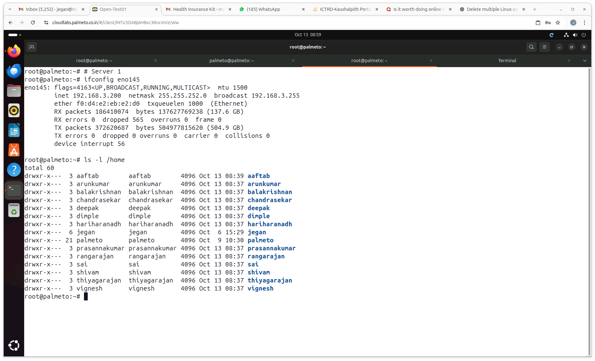

# Red Hat Openshift 13-17 Oct 2025

## Post Assessment Link
<pre>
https://forms.cloud.microsoft/r/706U7YjXXC
</pre>
 
## Feedback Link
<pre>
https://forms.cloud.microsoft/r/kEVhfs1tfg
</pre>

#### Note
<pre>
- While registering for the pre-test, kindly share your full name so that your L&D will be able to recognize you
- Do not share your BOFA email for pre-test or during the time for any reason
- Once everyone confirms after pre-test completion let's proceed with the training
</pre>

## Server 1 Participants ( 192.168.3.200 )

## Server 2 Participants ( 192.168.3.201 )

## Info - Check your lab

